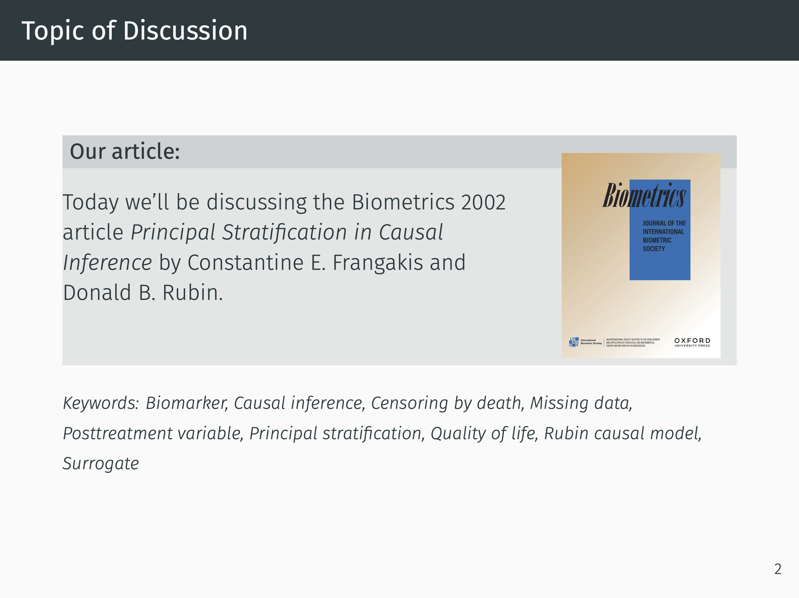
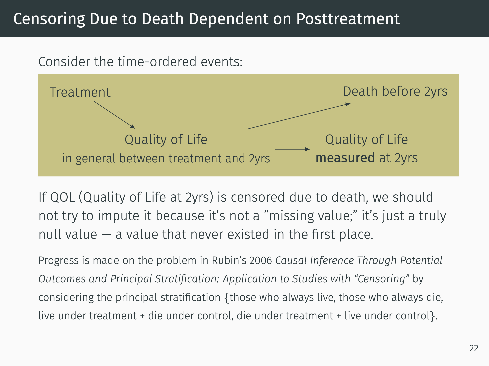
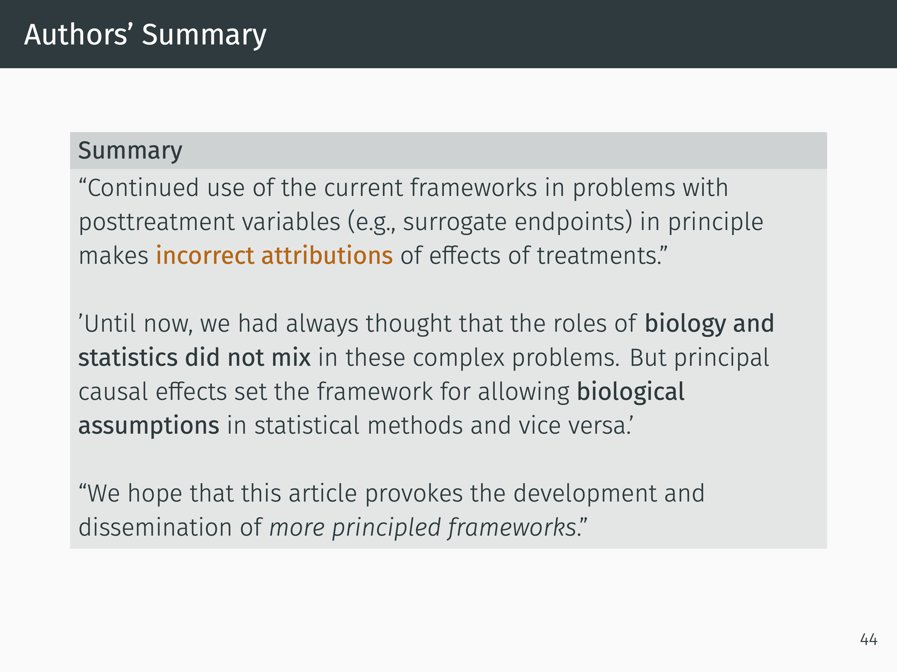

# Presentation Slides on Principal Stratification 

Talk given Tuesday April 16th, 2024

Principal Stratification is an approach proposed by Frangakis and Rubin (2002) to improve on methods for 
adjusting for intermediate variables. Broadly speaking, these intermediate variables can play several 
interesting roles: 

  - Indicating treatment compliance/non-compliance in randomized controlled trials,
  - Being causally upstream of missingness in the outcome,
  - As a surrogate for an expensive or challenging to obtain outcome.

Frangakis and Rubin propose state that a *causal effect* must be a comparison of potential outcomes 
$Y(1)$ and $Y(0)$ among *the same group of people* (or units). If $S$ is an intermediate 
variable between the treatment and outcome, then the basic principal strata are defined by 
pairs/2-tuples of potential intermediate value outcomes $(S(1), S(0))$. Since these are potential
values in the Rubin-Causal-Model framework, they are not affected by treatment and are therefore
variales that exist at baseline, so we can stratify the cohort according to their membership in 
principal strata (e.g., those with $(S(1) = s_1, S(0) = s_0)$). 

For example, if we restrict our analysis to $(S(1) = \text{takes drug}, S(0) = \text{does not take drug})$,
we're restricting our analysis to the *compliers*. 

See the slides for more detail!  Here's some a few highlighted slides to be more enticing: 

[[Screenshot of Slide 19](slide19.png)](BST_258_Presentation_Testa_Chen_Guo.pdf)

